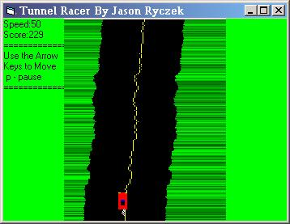

<div align="center">

## A Fun Game \(\~\*\- Tunnel Racer \-\*\~\)  Racing Game


</div>

### Description

This is the first version of this code and will be updated a lot since this is my first version and I couldn't figure out how to do some stuff. Please email me with better ideas! In this game the walls get closer together every half second, and so far, you don't race anyone, you just try not to hit the walls. Make sure you put in 2 timers and oen picturebox that you will name picTrack. Have fun!
 
### More Info
 


<span>             |<span>
---                |---
**Submitted On**   |
**By**             |[Jason Ryczek](https://github.com/Planet-Source-Code/PSCIndex/blob/master/ByAuthor/jason-ryczek.md)
**Level**          |Beginner
**User Rating**    |3.4 (31 globes from 9 users)
**Compatibility**  |VB 5\.0, VB 6\.0
**Category**       |[Games](https://github.com/Planet-Source-Code/PSCIndex/blob/master/ByCategory/games__1-38.md)
**World**          |[Visual Basic](https://github.com/Planet-Source-Code/PSCIndex/blob/master/ByWorld/visual-basic.md)
**Archive File**   |[](https://github.com/Planet-Source-Code/jason-ryczek-a-fun-game-tunnel-racer-racing-game__1-14332/archive/master.zip)


### Source Code

```
'-This program needs:
'-Timer1
'-Timer2
'-PictureBox - picTrack
'-That should do it!!!
Private Declare Sub Sleep Lib "kernel32" (ByVal dwMilliseconds As Long)
Dim lx(0 To 250) As Long, rx(0 To 250) As Long '-Right and Left Sides
Dim y(0 To 250) As Long
Dim cX As Long '-Car X
Dim Speed As Long '-The speed
Dim SideMove As Integer '-The sides move right/left
Dim Width_Amount As Long '-Distance apart between walls
Dim Score As Long '-The score
Sub Cycle()
Dim a As Integer
For a = 250 To 1 Step -1
 lx(a) = lx(a - 1)
 lx(0) = ((150 - Width_Amount) / 2) + SideMove
 rx(a) = rx(a - 1)
 rx(0) = lx(0) + Width_Amount
Next a
End Sub
Sub SidesChange()
SideMove = SideMove + Round((Rnd * 2), 1) - 1
If SideMove > 100 Then SideMove = 100
If SideMove < 5 Then SideMove = 5
End Sub
Private Sub Form_Load()
Me.Caption = "Tunnel Racer By Jason Ryczek"
Me.ScaleMode = 3
Me.Height = 4155
Me.Width = 5370
Me.AutoRedraw = True
Me.ClipControls = False
picTrack.Top = 0
picTrack.Left = 75
picTrack.Height = 250
picTrack.Width = 200
picTrack.ScaleMode = 3
picTrack.AutoRedraw = True
picTrack.ClipControls = False
picTrack.BorderStyle = 0
picTrack.Appearance = 0
Timer1.Interval = 1
Timer2.Interval = 500
Timer2.Enabled = True
New_Game
End Sub
Private Sub picTrack_KeyDown(KeyCode As Integer, Shift As Integer)
Select Case KeyCode
 Case vbKeyUp '-speed up
  Speed = Speed + 1
  If Speed > 50 Then Speed = 50
 Case vbKeyDown '-slow down
  Speed = Speed - 1
  If Speed < 5 Then Speed = 5
 Case vbKeyRight '-Move car right
  cX = cX + 2
 Case vbKeyLeft
  cX = cX - 2
 Case vbKeyP
  If Timer1.Enabled = True Then
   Timer1.Enabled = False
  Else
   Timer1.Enabled = True
  End If
End Select
Timer1.Interval = 51 - Speed
End Sub
Private Sub Timer1_Timer()
Dim a As Integer, b As Integer
Cycle
SidesChange
picTrack.Cls
Me.Cls
Me.Print "Speed:" & Speed
Me.Print "Score:" & Score
Me.Print "============="
Me.Print "Use the Arrow"
Me.Print "Keys to Move"
Me.Print " p - pause"
Me.Print "============="
For a = 1 To 250 Step 1
 rx(a) = lx(a) + Width_Amount
 picTrack.Line (0, a)-(10 + lx(a), a), RGB(0, 100 + (155 * Rnd), 0)
 picTrack.Line (lx(a), a)-(lx(a) + Width_Amount, a)
 picTrack.Line (rx(a), a)-(200, a), RGB(0, 100 + (155 * Rnd), 0)
 picTrack.PSet (lx(a) + (Width_Amount / 2), a), vbYellow
Next a
CarDraw cX '-This draws the car
HitWall cX '-This checks to see if the car hit the wall
Score = Score + 1
End Sub
Sub CarDraw(ByVal CarX As Long)
Dim gc As Integer
gc = Rnd * 255
picTrack.Line (CarX - 5, 215)-(CarX + 5, 235), vbRed, BF
picTrack.Line (CarX - 5, 215)-(CarX - 2, 215), vbYellow
picTrack.Line (CarX + 5, 215)-(CarX + 2, 215), vbYellow
picTrack.Line (CarX - 2, 225)-(CarX + 2, 230), vbBlack, BF
picTrack.Line (CarX - 2, 224)-(CarX + 2, 225), vbBlue, B
picTrack.Circle (CarX + (Rnd * 1) + 1, 236), 1, RGB(gc, gc, gc)
picTrack.Circle (CarX + (Rnd * 1) + 1, 238), 1, RGB(gc, gc, gc)
picTrack.Circle (CarX - (Rnd * 1) + 1, 240), 1, RGB(gc, gc, gc)
picTrack.Circle (CarX + (Rnd * 1) + 1, 242), 1, RGB(gc, gc, gc)
End Sub
Sub HitWall(ByVal CarX As Long)
Dim a As Integer, b As Long, d As Integer
Dim gc As Integer
gc = 255 * Rnd
Dim cX(0 To 25) As Long, cy(0 To 5) As Long
 If (CarX - 5 <= lx(215)) Or ((CarX + 5) >= rx(215)) Then
  For d = 0 To 5 Step 1
   cX(d) = ((CarX - 5) + (Rnd * 15))
   cy(d) = (215 + (Rnd * 20))
   picTrack.Circle (cX(d), cy(d)), ((Rnd * 4) + 1), RGB(gc, gc, gc)
  Next d
  Timer1.Enabled = False
  Me.Print "You Crashed!!!"
  New_Game
 End If
End Sub
Sub New_Game()
MsgBox "Ready, Set, Go!"
Dim a As Integer
Width_Amount = 150
cX = picTrack.Width / 2
Score = 0
Speed = 25
SideMove = 25
For a = 0 To 250
 lx(a) = (24 + (Rnd * 1))
 rx(a) = lx(a) + Width_Amount
Next a
Timer1.Enabled = True
End Sub
Private Sub Timer2_Timer()
Width_Amount = Width_Amount - 1
End Sub
```

